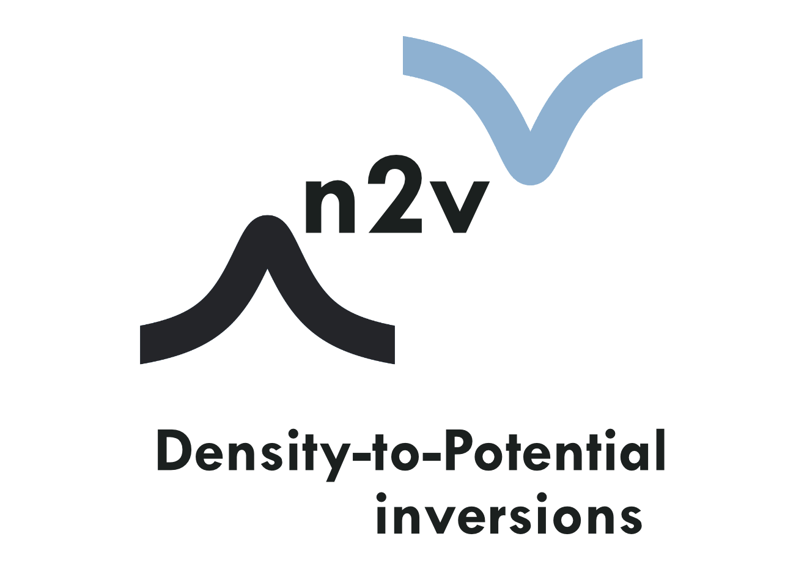

<p align="center">
<br>
 <br><br>
<a href="https://github.com/wasserman-group/n2v/actions"> </a>
<a href="https://lgtm.com/projects/g/wasserman-group/n2v/?mode=list"></a>
<a href="https://codecov.io/gh/wasserman-group/n2v"> </a>
<a href="https://github.com/wasserman-group/n2v/blob/main/LICENSE"></a>
<br>
</p>

  
### Tutorials:
- Learn how to use `n2v` with these [examples](https://github.com/wasserman-group/n2v_examples) 
<!-- - or try it without installing: [](https://mybinder.org/v2/gh/wasserman-group/n2v_examples/HEAD) -->

### Installation: 

- Through pip:
```
pip install ntov 
```
- conda coming soon!

#### Additional dependencies: 
- Psi4 must be installed. 
```
conda install -c psi4 psi4
```
- Libxc *and* pylibxc must be installed as well. 
```
conda install -c conda-forge libxc
```
- To communicate libxc with your python site-packages folder:
```
wget http://www.tddft.org/programs/libxc/down.php?file=5.1.7/libxc-5.1.7.tar.gz -O - | tar -xz # Download and extract libxc. May not be the most updated version
cd libxc-5.1.7 # Move into libxc directory. 
python setup.py install # Install pylibxc
```

### Additional Information: 
- We recommend the use of a conda environment (Python 3.7 or higher).
- If installing in Windows, we recommend the use of [WSL](https://docs.microsoft.com/en-us/windows/wsl/install-win10).
- If any unexpected error occurs, please contact Victor H. Chavez or Yuming Shi at gonza445@purdue.edu or shi449@purdue.edu respectively. 

### Copyright
Copyright (c) 2021, Wasserman Group  

#### Acknowledgements
*Victor H. Chavez* was supported by a fellowship from The Molecular Sciences Software Institute under NSF grant OAC-1547580.  
Project based on the [MolSSI Cookiecutter](https://github.com/molssi/cookiecutter-cms).  
